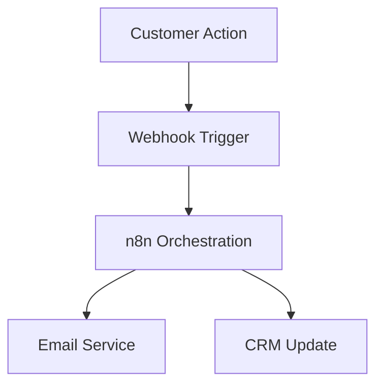

# Blueprint Service API Documentation

## Overview

The Blueprint Service API is the core product feature of the AAA Platform. It generates bespoke automation blueprints using industry-specific AI prompts, enforces tier-based access control, and provides multiple output formats.

**Version**: 2.0
**Base URL** (GenAI Core): `http://localhost:8000`
**Base URL** (Control Plane): `http://localhost:3000/api`

---

## Architecture

```
┌─────────────────┐
│  Control Plane  │  (Next.js)
│  Port: 3000     │
└────────┬────────┘
         │
         │ Feature Gating +
         │ Usage Tracking
         ▼
┌─────────────────┐
│  GenAI Core v2  │  (Python/FastAPI)
│  Port: 8000     │
└────────┬────────┘
         │
         │ v2 Prompts +
         │ OpenRouter
         ▼
┌─────────────────┐
│   Claude Opus   │  (via OpenRouter)
│   /Sonnet       │
└─────────────────┘
```

**Flow**:
1. User requests blueprint via Control Plane
2. Control Plane checks feature gating (tier limits)
3. Control Plane forwards to GenAI Core with user context
4. GenAI Core generates blueprint using v2 prompts
5. GenAI Core returns blueprint + metadata
6. Control Plane saves to database + tracks usage
7. User receives blueprint

---

## Authentication

### Control Plane API
Requires Clerk authentication via cookies/headers.

### GenAI Core API
Requires headers set by Control Plane:
- `X-User-Tier`: User's subscription tier (`tier1`, `tier2`, `tier3`)
- `X-User-Id`: User's unique identifier

**Note**: GenAI Core trusts Control Plane to handle authentication.

---

## Endpoints

### 1. Generate Blueprint (v2)

Generate a bespoke automation blueprint.

**Control Plane Endpoint**:
```http
POST /api/blueprints/generate-v2
```

**GenAI Core Endpoint**:
```http
POST /generate-blueprint
```

#### Request

**Headers** (GenAI Core):
```
Content-Type: application/json
X-User-Tier: tier2
X-User-Id: user_abc123
```

**Body**:
```json
{
  "industry": "E-commerce",
  "revenue_goal": "$500k/year",
  "tech_stack": ["Shopify", "Klaviyo", "Google Analytics"],
  "pain_points": "Abandoned cart rate is 75%, manual inventory tracking takes 10 hours/week, customer support responses delayed by 24+ hours",
  "output_format": "technical"
}
```

**Field Validation**:
| Field | Type | Required | Constraints |
|-------|------|----------|-------------|
| `industry` | string | ✅ | 1-100 characters |
| `revenue_goal` | string | ✅ | 1-100 characters |
| `tech_stack` | string[] | ✅ | 0-10 items |
| `pain_points` | string | ✅ | 10-2000 characters |
| `output_format` | string | ❌ | "technical", "executive", or "visual" (default: "technical") |

#### Response

**Success (200)**:
```json
{
  "blueprint": {
    "strategic_diagnosis": "Your E-commerce business is trapped in the 'Manual Execution Bottleneck'...",
    "proposed_architecture": "Hub-and-Spoke Automation Pipeline...",
    "components": [
      {
        "name": "Central Intelligence Hub",
        "tool": "n8n.io (self-hosted automation)",
        "purpose": "Orchestrates all workflow automations",
        "integration_notes": "Connects to all other components"
      },
      ...
    ],
    "automation_steps": [
      "1. Set up n8n.io on DigitalOcean ($12/month)...",
      "2. Create Airtable base with tables for Customers...",
      ...
    ],
    "estimated_impact": {
      "time_saved_per_week": "15-20 hours freed from manual tasks",
      "cost_reduction": "$78,000-$104,000 annually",
      "revenue_potential": "25-40% cart recovery rate increase",
      "roi_timeline": "8-12 weeks to break even"
    },
    "quick_wins": [
      "Quick Win 1: Automate welcome email (2 days, 3 hours/week saved)",
      ...
    ],
    "implementation_timeline": {
      "phase_1": "Week 1-2: Core infrastructure setup",
      "phase_2": "Week 3-4: Expand to 3-5 core workflows",
      "phase_3": "Month 2+: Advanced automations"
    }
  },
  "metadata": {
    "prompt_version": "2.0",
    "output_format": "technical",
    "industry_vertical": "ecommerce",
    "model_used": "anthropic/claude-3-opus",
    "generated_at": "2026-02-02T10:30:00Z",
    "user_tier": "tier2"
  },
  "validation": {
    "is_valid": true,
    "errors": [],
    "quality_score": 92.0
  },
  "user_input": {
    "industry": "E-commerce",
    "revenue_goal": "$500k/year",
    "tech_stack": ["Shopify", "Klaviyo", "Google Analytics"],
    "pain_points": "Abandoned carts..."
  }
}
```

**Validation Error (400)**:
```json
{
  "error": "Validation Error",
  "detail": "pain_points must be at least 10 characters",
  "error_code": "VALIDATION_ERROR"
}
```

**Rate Limit Exceeded (429)**:
```json
{
  "error": "You've reached your monthly limit for blueprint. Upgrade to continue.",
  "action": "blueprint",
  "limit": 3,
  "used": 3,
  "upgrade_url": "/pricing"
}
```

**Server Error (500)**:
```json
{
  "error": "Internal Server Error",
  "detail": "An unexpected error occurred. Please try again.",
  "error_code": "INTERNAL_ERROR"
}
```

---

### 2. List Supported Formats

Get available output formats.

**Endpoint**:
```http
GET /formats
```

#### Response

```json
{
  "formats": ["technical", "executive", "visual"],
  "descriptions": {
    "technical": "For developers - includes API details, code snippets, technical architecture",
    "executive": "For business owners - ROI focus, high-level overview, business outcomes",
    "visual": "For visual learners - includes Mermaid diagrams and flowcharts"
  }
}
```

---

### 3. List Supported Industries

Get supported industry verticals.

**Endpoint**:
```http
GET /industries
```

#### Response

```json
{
  "industries": [
    "ecommerce",
    "professional_services",
    "saas",
    "content_creation",
    "real_estate",
    "general"
  ],
  "descriptions": {
    "ecommerce": "E-commerce and retail businesses",
    "professional_services": "Consulting, legal, medical, accounting",
    "saas": "Software as a Service and tech companies",
    "content_creation": "Marketing agencies, content creators, media",
    "real_estate": "Real estate brokerages and property management",
    "general": "General business (fallback for unclassified industries)"
  }
}
```

---

### 4. Validate Request

Validate a blueprint request without generating (useful for frontend validation).

**Endpoint**:
```http
POST /validate-request
```

#### Request

```json
{
  "industry": "SaaS",
  "revenue_goal": "$1M ARR",
  "tech_stack": ["Stripe", "Intercom"],
  "pain_points": "High churn rate and low engagement",
  "output_format": "executive"
}
```

#### Response

**Valid (200)**:
```json
{
  "valid": true,
  "message": "Request is valid and ready for blueprint generation"
}
```

**Invalid (400)**:
```json
{
  "error": "Validation Error",
  "detail": "tech_stack: Maximum 10 tech stack items allowed"
}
```

---

### 5. Health Check

Check service status.

**Endpoint**:
```http
GET /health
```

#### Response

```json
{
  "status": "healthy",
  "timestamp": "2026-02-02T10:30:00Z",
  "services": {
    "blueprint_service": "operational",
    "prompt_system": "v2.0"
  }
}
```

---

## Output Formats

### Technical Format

**Target Audience**: Developers, technical teams

**Characteristics**:
- Technical terminology and jargon
- API endpoints and data models
- Code snippets or pseudocode
- Specific SDK/library references
- Error handling considerations

**Example Structure**:
```
Strategic Diagnosis: Technical analysis of architecture gaps
Proposed Architecture: Detailed system design with data flows
Components: Each includes API endpoints, data models
Automation Steps: Implementation commands and code snippets
Estimated Impact: Quantified metrics (response time, throughput)
```

### Executive Format

**Target Audience**: Business owners, executives

**Characteristics**:
- Clear, jargon-free language
- Business outcomes and ROI focus
- High-level architecture overview
- Time/cost savings emphasized
- Strategic recommendations

**Example Structure**:
```
Strategic Diagnosis: Business impact analysis
Proposed Architecture: Business process transformation
Components: Value proposition for each
Automation Steps: Business milestones
Estimated Impact: Revenue impact, cost savings, ROI timeline
```

### Visual Format

**Target Audience**: Visual learners, project managers

**Characteristics**:
- Mermaid diagram syntax for workflows
- Flowcharts for automation sequences
- Visual architecture diagrams
- Timeline visualizations
- Technical + visual combined

**Example Structure**:
```markdown


Strategic Diagnosis: ...
```

---

## Rate Limits

### Tier-Based Limits

| Tier | Blueprint Limit | Model | Features |
|------|----------------|-------|----------|
| **Tier 1 (Free)** | 3/month | Claude Sonnet | Basic features |
| **Tier 2 (Pro)** | Unlimited | Claude Opus | All features |
| **Tier 3 (Apex)** | Unlimited | Claude Opus | Priority + white-glove |

**Enforcement**:
- Limits enforced by Control Plane (feature gating)
- Usage tracked in database (UsageEvent model)
- Rate limit errors return HTTP 429

---

## Quality Scoring

Every blueprint receives a quality score (0-100):

**Scoring Criteria**:
- Required fields present: 20 points each (5 fields = 100)
- 4+ components: +10 points
- 6+ automation steps: +10 points
- Detailed impact metrics: +10 points
- Diagnosis 300+ chars: +10 points

**Score Interpretation**:
- **90-100**: Excellent quality
- **80-89**: High quality
- **70-79**: Good quality
- **60-69**: Acceptable quality
- **<60**: Low quality (may need regeneration)

---

## Error Handling

### Error Response Format

All errors follow this structure:
```json
{
  "error": "Error Type",
  "detail": "Detailed error message",
  "error_code": "ERROR_CODE"
}
```

### Common Error Codes

| Code | HTTP Status | Description |
|------|-------------|-------------|
| `VALIDATION_ERROR` | 400 | Invalid request body |
| `UNAUTHORIZED` | 401 | Missing or invalid authentication |
| `RATE_LIMIT_EXCEEDED` | 429 | Monthly blueprint limit reached |
| `INTERNAL_ERROR` | 500 | Unexpected server error |
| `SERVICE_UNAVAILABLE` | 503 | GenAI Core not available |

---

## Integration Examples

### JavaScript/TypeScript (Frontend)

```typescript
async function generateBlueprint(data: BlueprintRequest) {
  const response = await fetch('/api/blueprints/generate-v2', {
    method: 'POST',
    headers: {
      'Content-Type': 'application/json',
    },
    body: JSON.stringify(data),
  });

  if (!response.ok) {
    const error = await response.json();

    if (response.status === 429) {
      // Rate limit exceeded
      alert('You've reached your monthly limit. Please upgrade.');
      window.location.href = '/pricing';
      return;
    }

    throw new Error(error.detail || 'Blueprint generation failed');
  }

  const result = await response.json();
  return result;
}
```

### Python (Direct GenAI Core)

```python
import requests

def generate_blueprint(
    industry: str,
    revenue_goal: str,
    tech_stack: list[str],
    pain_points: str,
    user_tier: str = "tier1",
    user_id: str = "test_user"
):
    url = "http://localhost:8000/generate-blueprint"

    response = requests.post(
        url,
        json={
            "industry": industry,
            "revenue_goal": revenue_goal,
            "tech_stack": tech_stack,
            "pain_points": pain_points,
            "output_format": "technical"
        },
        headers={
            "X-User-Tier": user_tier,
            "X-User-Id": user_id
        }
    )

    response.raise_for_status()
    return response.json()
```

---

## Testing

### Running Tests

```bash
# GenAI Core tests
cd aaa-platform/genai-core
pytest tests/test_integration.py -v

# Control Plane tests (future)
cd aaa-platform/control-plane
npm test
```

### Test Coverage

- ✅ Health check endpoints
- ✅ Blueprint generation (success/failure)
- ✅ Input validation
- ✅ Tier-based model selection
- ✅ Rate limiting (via feature gating)
- ✅ Output format support
- ✅ Industry vertical support

---

## Performance

### Expected Response Times

| Tier | Model | Average Time | Max Time |
|------|-------|--------------|----------|
| Tier 1 | Sonnet | 8-12 seconds | 20 seconds |
| Tier 2 | Opus | 15-25 seconds | 40 seconds |
| Tier 3 | Opus | 15-25 seconds | 40 seconds (priority) |

**Factors Affecting Speed**:
- LLM model (Sonnet faster than Opus)
- Blueprint complexity
- OpenRouter API latency
- Network conditions

---

## Troubleshooting

### Issue: "GenAI Core is not available"

**Symptom**: HTTP 503 error
**Cause**: GenAI Core service not running
**Solution**:
```bash
cd aaa-platform/genai-core
python main_v2.py
```

### Issue: "Unauthorized - User ID not provided"

**Symptom**: HTTP 401 error
**Cause**: Missing X-User-Id header
**Solution**: Ensure Control Plane sets header after Clerk authentication

### Issue: Rate limit exceeded

**Symptom**: HTTP 429 error
**Cause**: User reached monthly blueprint limit
**Solution**: User must upgrade to Tier 2/3 for unlimited blueprints

### Issue: Low quality score (<60)

**Symptom**: Blueprint generated but quality_score < 60
**Cause**: LLM didn't follow prompt structure
**Solution**: Regenerate blueprint or manually enhance prompts

---

## Related Documentation

- [Prompt Engineering Guide](./PROMPT-ENGINEERING-GUIDE.md) - v2 prompt system
- [Feature Gating Guide](./FEATURE-GATING.md) - Tier-based limits
- [Authentication Guide](./AUTHENTICATION-GUIDE.md) - Clerk integration

---

## Support

For questions or issues:
- Review integration tests: `tests/test_integration.py`
- Check GenAI Core logs: `python main_v2.py`
- Test with mock mode: `USE_MOCK_LLM=true python main_v2.py`
